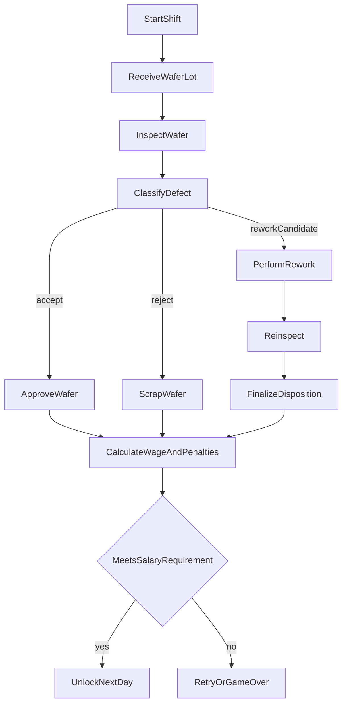

# WebVR Wafer-Inspector

## MVP Game Design Document (Training-First)

## 1) High Concept

`WebVR Wafer-Inspector` is a desktop-first, optional-VR training game where players act as a fab inspection operator. The player evaluates wafers, decides `Accept`, `Reject`, or `Rework`, performs limited corrective procedures, and must meet both salary and competency thresholds to progress.

The design goal is dual-purpose:
- Build real introductory intuition for semiconductor inspection workflows.
- Preserve a tense, immersive, game-like loop inspired by high-pressure rule-check games.

## 2) Player Fantasy And Pillars

Player fantasy:
- "I am a trusted cleanroom operator catching costly defects under pressure."

Design pillars:
- **Training accuracy first**: Every mechanic maps to a concrete learning outcome.
- **Readable realism**: Fab logic is believable, but simplified for retention and playability.
- **Diegetic immersion**: UI appears as physical tools and in-world instrumentation.
- **Pressure with feedback**: Time and quota create tension; debriefs convert mistakes into learning.

## 3) Target Audience And Learning Outcomes

Primary audience:
- Students and early-career semiconductor trainees.
- Adjacent technical learners exploring fab operations.

Entry assumptions:
- No prior expert process knowledge required.

Measurable competency targets (MVP):
- Defect detection accuracy >= 85% in Day 3+ scenarios.
- Correct disposition (accept/reject/rework) >= 80%.
- False accept rate <= 10% on killer defects.
- Rework success rate >= 70% on rework-eligible defects.
- Player can identify at least 4 defect classes and their likely action path.

## 4) Platform, Session, Controls

Platform:
- Desktop browser first (mouse + keyboard).
- Optional WebXR VR mode for supported headsets.

Session model:
- 1 in-game shift = 8-12 minutes.
- MVP includes 1 fully polished playable day with scaling variants.

Controls:
- Desktop: click/drag rotate wafer, inspect tool toggles, stamp actions, hotkeys for core tools.
- VR: grab/point interactions with world-space tool anchors.

## 5) Core Loop

1. Receive wafer lot with traveler context.
2. Inspect wafer using microscope/illumination modes and checklist.
3. Classify observed anomalies.
4. Decide disposition:
   - `Accept` if within tolerance.
   - `Reject` if killer/irreversible.
   - `Rework` if corrective route exists.
5. If rework: perform mini-procedure, then reinspect.
6. Finalize with physical stamp + tray routing.
7. End-shift payroll + competency debrief + progression gate.



## 6) Semiconductor Realism Envelope (Approachable)

The game abstracts front-end process checkpoints while preserving conceptual correctness:
- Wafer starts as polished silicon substrate.
- Patterning context references photolithography, etch, deposition, and metrology touchpoints.
- Inspection appears at critical post-step gates where defects affect downstream yield.
- Rework only applies to reversible/surface-level/process-window issues.
- Permanent structural damage or severe pattern failure routes to reject/scrap.

Process literacy framed in debrief language:
- "Likely lithography alignment issue."
- "Particle contamination signature."
- "Possible etch bridge/open risk."

## 7) Defect Taxonomy And Disposition Matrix

Defect classes (MVP):
- **Particle contamination**: often reworkable cleaning route, sometimes reject if repeated cluster.
- **Surface scratch**: shallow scratch may pass/rework; deep scratch = reject.
- **Pattern bridge**: high short-risk, usually reject unless flagged as removable resist artifact.
- **Pattern open/gap**: continuity risk, generally reject.
- **Alignment/misalignment indicator**: rework candidate only in specific pre-etch contexts.
- **Cosmetic benign variance**: accept if within tolerance thresholds.

Disposition logic:
- `Accept`: non-killer, within threshold, no process-critical mismatch.
- `Rework`: reversible defect + stage supports correction + time budget permits.
- `Reject`: irreversible, high-risk, or post-rework failure.

## 8) Rework Mini-Interactions

MVP rework actions:
- **Clean cycle**: select solvent profile, apply timed wipe/spray, verify residue removal.
- **Resist strip-and-reinspect abstraction**: trigger controlled strip sequence, incur time/material cost.
- **Tool recalibration request** (limited uses): lowers repeated pattern defect chance next few wafers.

Rework constraints:
- Each rework consumes shift time and material budget.
- Misapplied rework can worsen disposition score.
- Max rework attempts per wafer: 1 (MVP clarity).

Failure states:
- Over-processing damage.
- Residual defect after rework.
- Exceeding shift time causes auto-finalization penalties.

## 9) Rule System And Day Progression

MVP progression pattern:
- **Day 1 (Onboarding)**: 2 defect classes, guided checklist, no hard ambiguity.
- **Day 2 (Pressure)**: tighter time target, new class (bridge/open), first false-positive traps.
- **Day 3 (Judgment)**: rework eligibility appears, mixed severity and context-dependent decisions.
- **Day 4+ (Post-MVP hook)**: tool unlock interactions and multi-factor checks.

Rule escalation principle:
- Introduce one major cognitive load at a time (new defect type OR new policy OR new tool).

Data-driven rule format (authoring sketch):
```ts
type DailyRule = {
  id: string
  day: number
  enabledDefectClasses: string[]
  reworkAllowedFor: string[]
  toleranceProfile: "lenient" | "normal" | "tight"
  salaryThreshold: number
  competencyThreshold: number
  notes: string
}
```

## 10) Economy, Scoring, And Gates

Compensation model:
- Base pay per processed wafer.
- Bonus for accurate high-throughput streaks.
- Fines for false accept, wrong reject, procedural violation.
- Material/time cost for rework attempts.

Two-gate progression:
- **Salary gate**: meet minimum pay to keep job/day progression.
- **Competency gate**: meet quality floor to unlock next training tier.

Why dual gate:
- Prevents speed-only play from passing training.
- Prevents ultra-slow perfectionism from bypassing operational goals.

## 11) Assessment Model (Training Analytics)

Tracked metrics per shift:
- Detection accuracy.
- False accept rate.
- False reject rate.
- Rework success rate.
- Decision latency by defect class.
- Checklist compliance events.

Debrief outputs:
- Top 3 recurring mistakes.
- Defect classes with confusion score.
- Recommended focus module ("recheck bridge/open discrimination").
- Trend vs previous shift.

Pass/fail thresholds (MVP defaults):
- Salary >= target and competency >= target -> pass.
- Salary pass but competency fail -> remediation shift.
- Competency pass but salary fail -> efficiency coaching shift.

## 12) Educational Scaffolding

Guided mode (default first run):
- Contextual prompts on first encounter per defect class.
- Tooltips define process terms in plain language.
- "Why this matters" cards tie defect to yield/risk.

Hint fade-out:
- Repeated successful use auto-reduces hint frequency.
- Optional "training assist" toggle for instructors.

Knowledge supports:
- In-world glossary tablet.
- Shift-end micro-quiz (3-5 prompts) optional for certification mode.

## 13) Diegetic + Skeuomorphic Interface

Interface principles:
- No floating HUD for core actions.
- Critical actions mapped to physical objects and machine panels.

Primary in-world UI:
- Workbench tray (incoming/outgoing wafers).
- Physical microscope station with illumination dial.
- Clipboard rulebook with daily bulletins.
- Mechanical accept/reject/rework stamp set.
- Overhead fab display board for quota/time/pay.
- Incident printer for alerts and coaching notes.

Readability constraints:
- High-contrast industrial labels.
- Minimum legible font sizing for desktop and VR parity.
- Distinct auditory confirmations for each disposition.

## 14) Balancing Knobs

Tunable systems:
- Defect spawn rate by class.
- Ambiguity frequency.
- Time per wafer target.
- Fine multiplier by error severity.
- Rework cost and success probability.
- Hint strictness in training mode.

MVP target pacing:
- 20-35 wafer decisions per shift.
- 10-20% rework candidates.
- 5-12% killer defects.

## 15) MVP Scope Boundaries

In scope:
- Single environment (inspection bay).
- Single shift loop with scalable rule variants.
- 5-6 defect classes.
- Core rework interactions (clean, strip abstraction, recalibration request).
- Salary + competency dual-gate progression.
- End-shift analytics debrief.

Out of scope (post-MVP):
- Full fab map traversal.
- Narrative branching campaign.
- Multiplayer operator teams.
- Advanced packaging-stage gameplay.

## 16) QA, Testing, And Success Criteria

Training success criteria:
- Majority of first-time users can explain disposition logic after one shift.
- Error recurrence declines over three repeated shifts.

Gameplay success criteria:
- Reported tension and immersion remain high without confusion spikes.
- Desktop and VR interaction parity within acceptable performance range.

Technical success criteria:
- Stable frame pacing in browser targets.
- Deterministic scoring reproducibility for same seeded scenario.

---

## MVP Asset Inventory (Prioritized)

Legend:
- Priority: `P0` must-have, `P1` should-have, `P2` nice-to-have.
- Placeholder-safe: `Yes` means graybox/temp asset acceptable for MVP test.

### A) 3D Environment And Props

- Cleanroom inspection bay module | P0 | Placeholder-safe: Yes | Purpose: core play space
- Inspection workbench (modular) | P0 | Yes | Purpose: all object interactions
- Wafer cassette/FOUP-style containers | P0 | Yes | Purpose: lot intake fantasy
- Tool rack (cleaning/rework tools) | P0 | Yes | Purpose: physical action anchors
- Overhead shift board display | P0 | Yes | Purpose: quota/time/salary at-a-glance
- Ambient cleanroom set dressing (panels, ducts, signage) | P1 | Yes | Purpose: immersion
- Secondary background machinery silhouettes | P2 | Yes | Purpose: depth and atmosphere

### B) Interactive Tools And Diegetic UI Props

- Microscope body + stage + focus knob | P0 | Yes | Purpose: primary inspection interface
- Illumination control dial/switches | P0 | Yes | Purpose: defect visibility modulation
- Physical stamp set (accept/reject/rework) | P0 | No | Purpose: irreversible final action clarity
- Clipboard rulebook + daily bulletin pages | P0 | Yes | Purpose: changing rules interface
- In-world glossary tablet | P1 | Yes | Purpose: educational lookup
- Incident printer object + paper output | P1 | Yes | Purpose: alerts/debrief diegesis
- Rework console panel | P1 | Yes | Purpose: mini-interaction container

### C) Wafer And Defect Visual Assets

- Base wafer material set (clean, used, contaminated) | P0 | No | Purpose: core readability
- Defect decal/overlay library (particle, scratch, bridge, open, misalignment) | P0 | No | Purpose: training targets
- Severity variants per defect class | P0 | Yes | Purpose: progressive difficulty
- Wafer map overlay texture set (optional training view) | P1 | Yes | Purpose: pattern learning
- Rework state transitions (before/after visuals) | P1 | Yes | Purpose: feedback on action outcome
- Edge-case synthetic defects for QA | P1 | Yes | Purpose: test coverage

### D) Character/Animation

- Player hand/controller interaction rigs | P0 | Yes | Purpose: desktop+VR manipulation
- Tool use animations (stamp, wipe, panel press) | P0 | Yes | Purpose: action clarity
- UI prop micro-animations (paper print, light blink) | P1 | Yes | Purpose: responsiveness
- NPC supervisor avatar/voice source | P2 | Yes | Purpose: optional narrative flavor

### E) VFX, SFX, Music, Voice

- Interaction SFX pack (click, stamp, tray, alert) | P0 | Yes | Purpose: state confirmation
- Defect detection audio cues by severity | P1 | Yes | Purpose: training reinforcement
- Rework process sounds (spray, purge, cycle complete) | P1 | Yes | Purpose: procedural feedback
- Ambient cleanroom loop | P0 | Yes | Purpose: immersion baseline
- Adaptive tension music layers | P1 | Yes | Purpose: pacing
- Instructor/debrief voice lines | P2 | Yes | Purpose: coaching accessibility

### F) UX Text And Localization

- Defect glossary entries (plain-language definitions) | P0 | No | Purpose: educational clarity
- Rulebook daily bulletins | P0 | No | Purpose: progression mechanics
- Debrief templates and coaching copy | P0 | No | Purpose: learning loop closure
- Error/fine reason strings | P0 | No | Purpose: transparency
- Localization key file (en baseline) | P1 | Yes | Purpose: expansion readiness

### G) Technical Assets (Code/Data/Materials)

- Rule configuration data tables | P0 | No | Purpose: scalable day authoring
- Defect generation profiles + seeded scenarios | P0 | No | Purpose: deterministic training runs
- Scoring/economy config tables | P0 | No | Purpose: balancing
- Analytics event schema | P0 | No | Purpose: assessment reporting
- Material/shader presets for wafer readability | P0 | Yes | Purpose: consistent visibility
- Prefab library for interactive stations | P1 | Yes | Purpose: iteration speed
- Accessibility profiles (contrast/audio/text size) | P1 | Yes | Purpose: inclusive training

### H) QA Fixtures And Telemetry

- Golden scenario set (known outcomes) | P0 | No | Purpose: regression validation
- Automated scoring test cases | P0 | No | Purpose: logic reliability
- Input parity test scripts (desktop vs VR) | P1 | Yes | Purpose: control consistency
- Performance benchmark scenes | P1 | Yes | Purpose: runtime stability
- Instructor report export template | P2 | Yes | Purpose: external training workflows

---

## Source References Used

- [How Semiconductor Yields Vastly Improved (Asianometry)](https://www.youtube.com/watch?v=7muPttN8GRU)
- [Samsung Semiconductor Manufacturing Process Overview](https://www.youtube.com/watch?v=Bu52CE55BN0)
- [300mm Wafer Fab Virtual Tour (Texas Instruments)](https://www.youtube.com/watch?v=5a8xjH2tOkM)
- [Mastering Semiconductor Technology: Fundamentals of Photolithography (Brewer Science)](https://www.brewerscience.com/blog-photolithography-fundamentals/?utm_source=chatgpt.com)
- [Semiconductors 101: Chips, Wafers, and How They Are Made (Singapore EDB)](https://www.edb.gov.sg/en/business-insights/insights/semiconductors-101-chips-wafers-and-how-they-are-made.html)
- [FabStart Taiwan Semiconductor Fab Walkthrough](https://iop.upou.edu.ph/semicon/fabstart/)
- [Introduction to Semiconductor Processing (SEMI)](https://www.semi.org/sites/semi.org/files/2023-07/Introduction%20to%20Semiconductor%20Processing.pdf)
